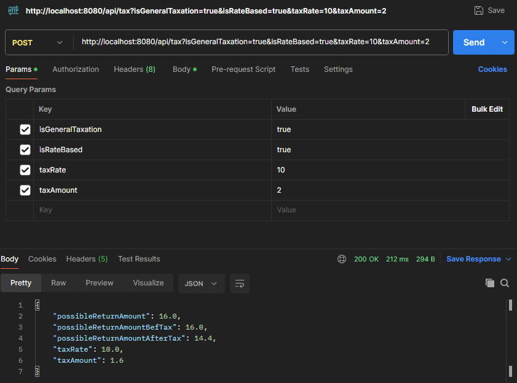
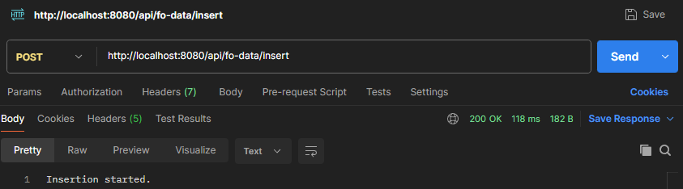

# 📌 Project Overview
This project provides an API for handling and processing data, supporting data insertion and retrieval operations.

## 📂 Setup & Installation
### 1️⃣ Clone the Repository
```bash
git clone <repository-url>
cd <project-folder>
```

### 2️⃣ Configure the Database
Make sure PostgreSQL is running and update the `application.properties` or `.env` file with the correct database credentials.

### 3️⃣ Run the Application
```bash
mvn spring-boot:run  # If using Maven
# OR
./gradlew bootRun   # If using Gradle
```

## 📌 Usage
### 📈 Calulate Tax
Use **Postman** or any API client to send a POST request:
Query paramethers **isGeneralTaxation** and **isRateBases** have **Boolean** value.
Query paramethers **taxRate** and **taxAmount** have **Integer** value.
```http
POST /api/tax?isGeneralTaxation=true&isRateBased=true&taxRate=10&taxAmount=2
```
Just make sure you provide the body, and the paramethers defined like in this example below:
```json
{
    "traderId": 1,
    "playedAmount": 5,
    "odd": 3.2
}
```

### 📝 Insert Data
Use **Postman** or any API client to send a POST request:
```http
POST /api/fo-data/insert
```
It will start inserting data from the file saved locally inside the project directory under **resources/fo_random.txt**

### 📊 Retrieve Data
To get difference between firs and last added row in database:
```http
GET /api/fo-data/min-max
```

## 📸 Screenshots
🔻 *Insert data request (Postman)*



🔻 *Retrieve data response*



## ❗ Notes
(DIDN'T KNOW HOW TO APPROACH THIS PROBLEM SO I HAVE PART WHERE DUPLICATES ARE IGNORED COMMENTED OUT IN CODE)
- Duplicate entries (match_id, market_id, outcome_id) are ignored to maintain integrity.
- Any extra parameters after the third field are combined into a single `specifiers` field.

